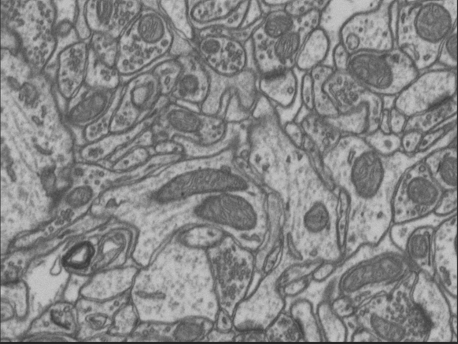
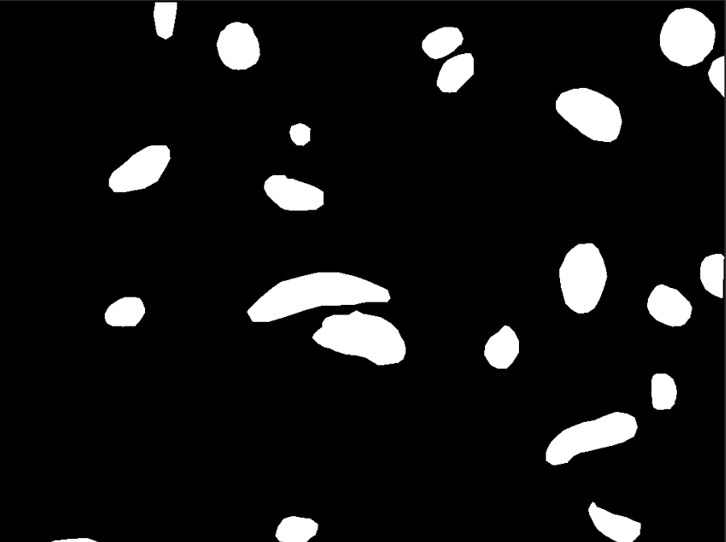

# U-Net: Semantic Segmentation with keras
Semantic segmentation on Electron Microscopy dataset using U-Net 

The architecture is inspired by [U-Net: Convolutional Networks for Biomedical Image Segmentation](https://arxiv.org/abs/1505.04597).

## Overview 

### Data 
The dataset has been sourced from [EPFL](https://www.epfl.ch/labs/cvlab/data/data-em/),consisting of images taken from the CA1 hippocampus region of the brain, but the images provided are in form of a single tif file each for training and ground truth, so each was broken down frame-by-frame and then further reduced into patches of 256x256.   

  
